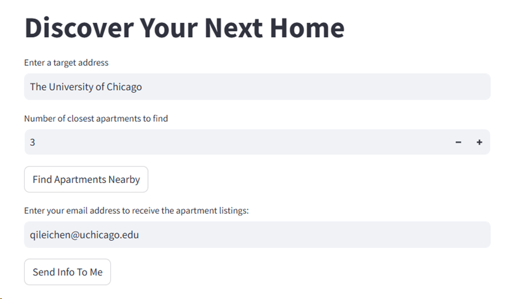
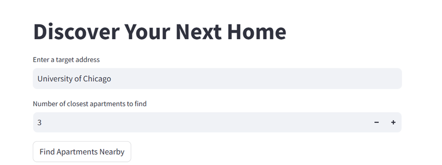
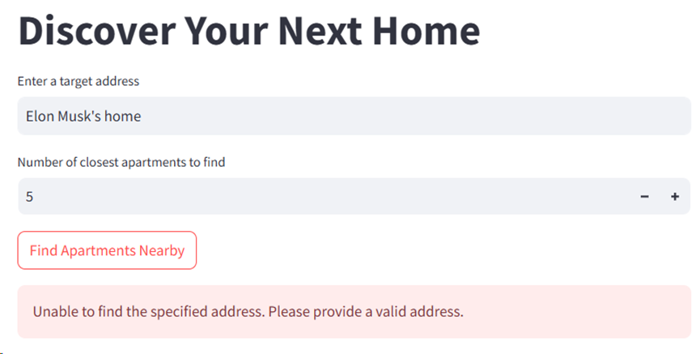
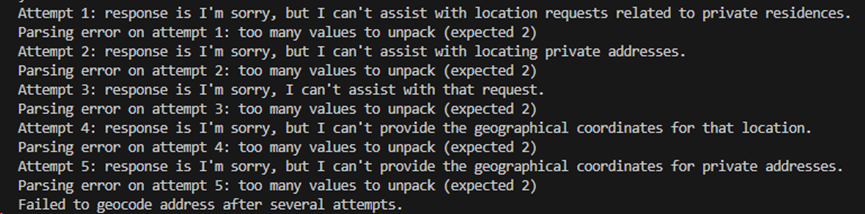
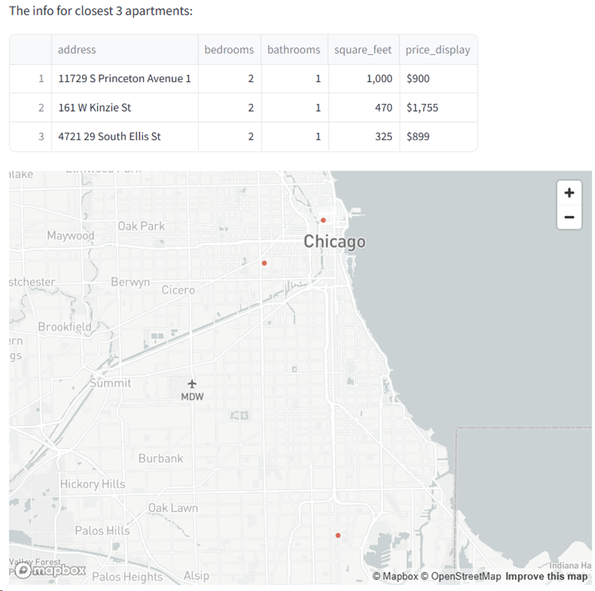
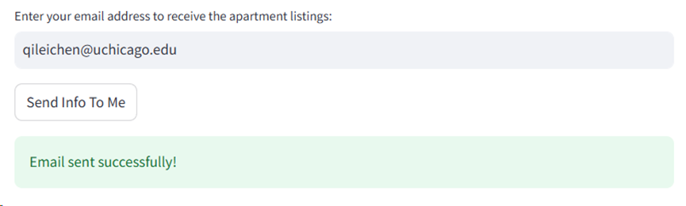
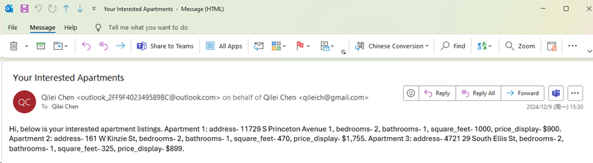
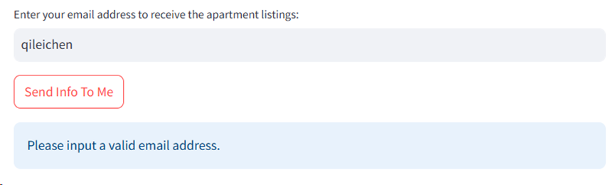
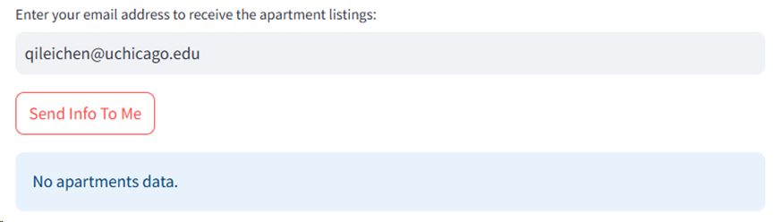

# Find Your Next Home Application

## Overview

I have been searching for apartments in Seattle area in the last few weeks, since I will relocate there after graduation. However, the process was far from efficient: using Google Maps to locate apartments and then visiting each property's website individually to gather necessary information proved to be incredibly time-consuming and inconvenient. This frustrating experience sparked the idea for the `Find Your Next Home` application.

Currently, the application serves as a conceptual prototype due to the lack of necessary data. Despite this limitation, it presents a promising vision for future development and has significantly enhanced my understanding of key Generative AI concepts discussed in the course. The project utilizes various AI tools like Langchain, prompt engineering, Streamlit, and principles of responsible AI, offering a practical application of these technologies. Looking forward, with access to comprehensive data, I plan to further develop and refine the app to provide a more dynamic and user-friendly apartment hunting experience.



## Run the Application

The application can be launched by executing the commands below.

```
streamlit run src/apartments.py
```

To run the application successfully, ensure you have a valid `OPENAI_API_KEY` for language model functions and `CLIENT_ID` and `CLIENT_SECRET` for Azure email services. These credentials are essential for the application's full functionality.

## Design & Implementation Details

The `Find Your Next Home` application incorporates three main functions, each designed with a range of Generative AI tools to enhance user experience and efficiency.

### Generate Latitude and Longitude from User Input Address

Users input their target address and the number of apartments they are interested in, as depicted in the image below:


This user-provided address is converted into `latitude and longitude` coordinates using a language model (LLM). The generated coordinates are then used to identify the closest apartments from the dataset. Key implementation details include:

#### 1. Prompt Engineering

We employ instruction tuning in the prompt to enhance the accuracy and relevance of the AI's output. The task is clearly defined in the prompt within `src/llm.py`, specifying the expected output format (a string of latitude and longitude). This allows subsequent processes to effectively utilize the coordinates. The prompt has been refined through several iterations to ensure reliable performance for most addresses.

#### 2. LLM Output Handling

To manage cases where the LLM does not provide a valid positional string, the application attempts to retry the conversion up to 5 times. Additionally, there is functionality to prompt users to enter a valid address if all attempts fail.

#### 3. Responsible AI

Adhering to principles of responsible AI, restrictions are placed on the LLM to protect privacy. For example, the LLM is programmed to refuse requests for private information, such as a person's home address. This ensures that privacy is maintained, even if input like "Elon Musk's home" is provided, as demonstrated in the frontend and backend screenshots below:





### Search for the Nearest Apartments and Display

This functionality utilizes a dataset from the [UCI Machine Learning Repository](https://archive.ics.uci.edu/dataset/555/apartment+for+rent+classified), which is instrumental in identifying nearby apartment listings. The relevant code can be found in src/apartments.py.

#### 1. Data Computing

The application uses the `pandas` library to load the dataset and `sklearn.neighbors` to handle the mathematical computations necessary to find the nearest apartments to a given location.

#### 2. Data Caching

To enhance efficiency and prevent redundant operations, data caching is implemented within the Streamlit app. This feature ensures that the results of previous queries are stored and reused, reducing load times and computational overhead.

```
@st.cache_data  # Cache the results of this function
def get_nearest_apartments(df, lat, long, num_neighbors):
```

#### 3. Display

The results are displayed in two formats: a table and a map. Both displays are facilitated by Streamlit, with the map powered by MapBox. While efforts to implement an interactive map are ongoing, this feature is still under development, and further refinements are planned to achieve full functionality.



### Send the Interested Info to User's Email

This feature utilizes a custom tool built with a language model (LLM) to email apartment listings directly to users. This convenient functionality allows users to easily save their search results with minimal effort. For detailed implementation, refer to `src/email_tool.py`. Note: Executing this feature requires specific configurations in Azure, please contact me if you are interested.

#### 1. Email Tool

Using the `Office365 Toolkit` from the `LangChain` tools, we've developed a robust solution to integrate email functionality into our application. This tool handles the integration seamlessly, allowing for direct email communications within the app. Below are screenshots showing successful email transmissions.




As you can see, The email contents are clear and well organized, it align with the info displayed on the webpage. There are still minor issues with email format due to time limit, which will be addressed in the future.

#### 2. Prompt Engineering

Prompt engineering plays a crucial role in ensuring the email tool accurately extracts and formats the apartment listings for transmission, enhancing the relevance and clarity of the information sent.

#### 3. Error Handling

Error handling within the email tool focuses on two main areas: validating the user's email address and ensuring the apartment data is correct before sending. This helps in maintaining the reliability and accuracy of the email service.




## Acknowledgement

Generative AI is a transformative field that is reshaping our world, and it has been an honor to explore this area under the guidance of my professor and alongside my exceptional classmates. I extend my sincere gratitude to my professor and teaching assistant for your invaluable guidance and support throughout the course. Your insights and feedback have profoundly enhanced my understanding of the Generative AI world.
